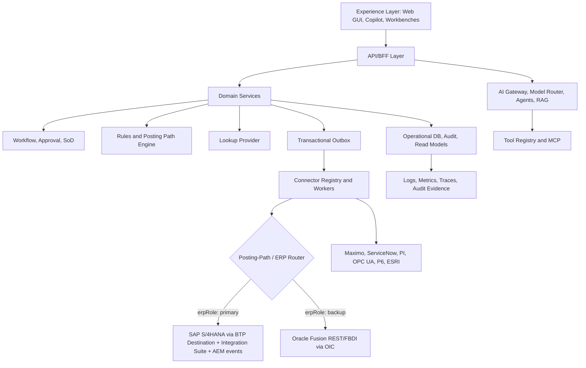

# Enterprise Layered Architecture

## Minimum production layers

| Layer | Mandatory capability |
|---|---|
| Frontend | Role-aware app shell, route guards, accessible components, no secrets |
| API | Tenant context, correlation ID, auth, validation, OpenAPI |
| Domain | Aggregates, invariants, lifecycle states, transaction services |
| Workflow | Approval, SoD, assignment, escalation, e-signature if needed |
| Rules | Validation, defaulting, derivation, posting path, fallback policy |
| Connectors | Object-aware, simulator/sandbox/live, idempotent, audited |
| Data | RLS, audit ledger, outbox, idempotency, read models |
| AI | Model router, agent policies, source grounding, evals, audit |
| Security | RBAC, ABAC, RLS, data classification, secrets, policy engine |
| Observability | OTel traces, structured logs, alerts, DLQ metrics, AI quality metrics |
| DevSecOps | CI/CD, IaC, environment promotion, rollback, DR, runbooks |

## Cloud-ready SaaS posture

| Concern | Standard |
|---|---|
| Tenancy | Pooled app tier + tenant-scoped data (Postgres RLS); tenant context propagated end-to-end via correlation ID; per-tenant connector registry and ERP routing |
| ERP posture | SAP S/4HANA primary (Public Edition clean-core rules by default, Private deltas via ADR); Oracle Fusion as backup SoR — one system of record per object per tenant, no dual-post (`docs/integration/DUAL_ERP_ROUTING_AND_FAILOVER_POLICY.md`) |
| Integration runtime | SAP Integration Suite (iFlows, API Management) + advanced event mesh for events; Edge Integration Cell where data residency or in-landscape processing is required; OIC for Oracle-side flows |
| Extension rule | Side-by-side on BTP with released APIs only — fit-to-standard first, configure second, extend side-by-side third, custom core never without ADR |
| Regions/residency | Region-pinned deployments; model-router region-match rules for restricted data; per-region event brokers |
| Elasticity | Stateless API/worker tiers, queue-backed outbox workers, horizontal autoscale; per-tenant rate limits and noisy-neighbor quotas |
| Upgrade safety | Zero-downtime migrations; ERP release calendars tracked (S/4 releases, Oracle 26A–26D) with contract-test regression per update |
| Commercial ops | Per-tenant usage metering (API calls, connector posts, AI tokens), FinOps dashboards, cost allocation tags |
