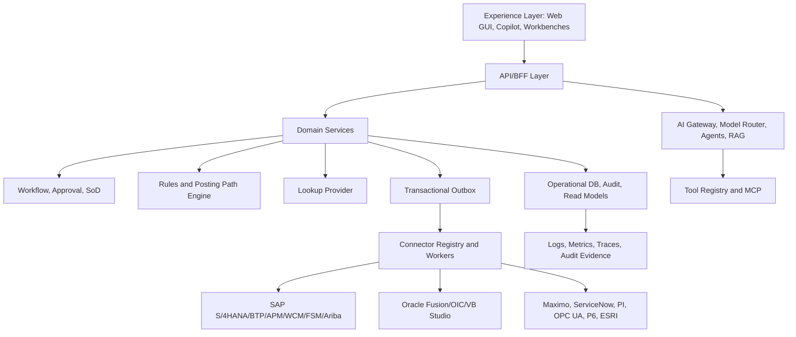

# Enterprise Layered Architecture

## Minimum production layers

| Layer | Mandatory capability |
|---|---|
| Frontend | Role-aware app shell, route guards, accessible components, no secrets |
| API | Tenant context, correlation ID, auth, validation, OpenAPI |
| Domain | Aggregates, invariants, lifecycle states, transaction services |
| Workflow | Approval, SoD, assignment, escalation, e-signature if needed |
| Rules | Validation, defaulting, derivation, posting path, fallback policy |
| Connectors | Object-aware, simulator/sandbox/live, idempotent, audited |
| Data | RLS, audit ledger, outbox, idempotency, read models |
| AI | Model router, agent policies, source grounding, evals, audit |
| Security | RBAC, ABAC, RLS, data classification, secrets, policy engine |
| Observability | OTel traces, structured logs, alerts, DLQ metrics, AI quality metrics |
| DevSecOps | CI/CD, IaC, environment promotion, rollback, DR, runbooks |
